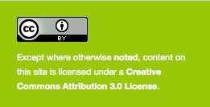

<h1 align="center">
  <br>
  Whatever the Weather
</h1>

<h4 align="center">
  <a>Sensing & IOT Module, Design Engineering, Imperial College London</a>
  <br><br>
  
</h4>

<p align="center">
	<sub>A project exploring the effect of weather on music taste utilising the Spotify and DarkSky API's. </sub>
</p>
<br>
<p align="center">
</h1>
<br>


## Clone the repository

```bash
git clone http://github.com/leahpattison/Sensing-IOT
```

## Compiling the documentation offline

```bash
cd docs/
make html
open build/html/index.html
```

## References

* Information for implementing Spotify API

``` bash
https://developer.spotify.com/documentation/web-api/
```

* Information for implementing Dark Sky API

``` bash
https://darksky.net/dev
```


